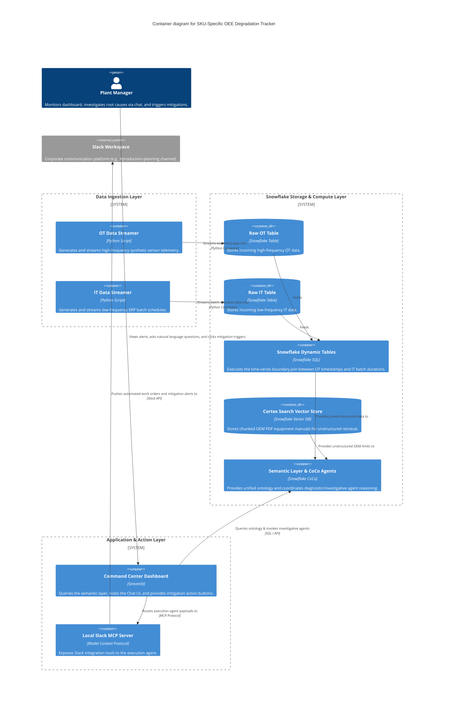
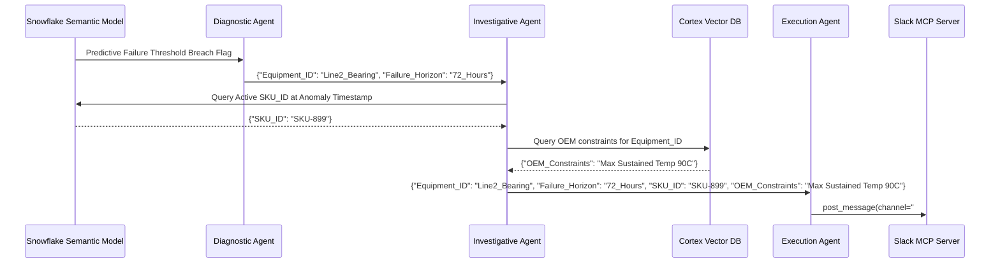
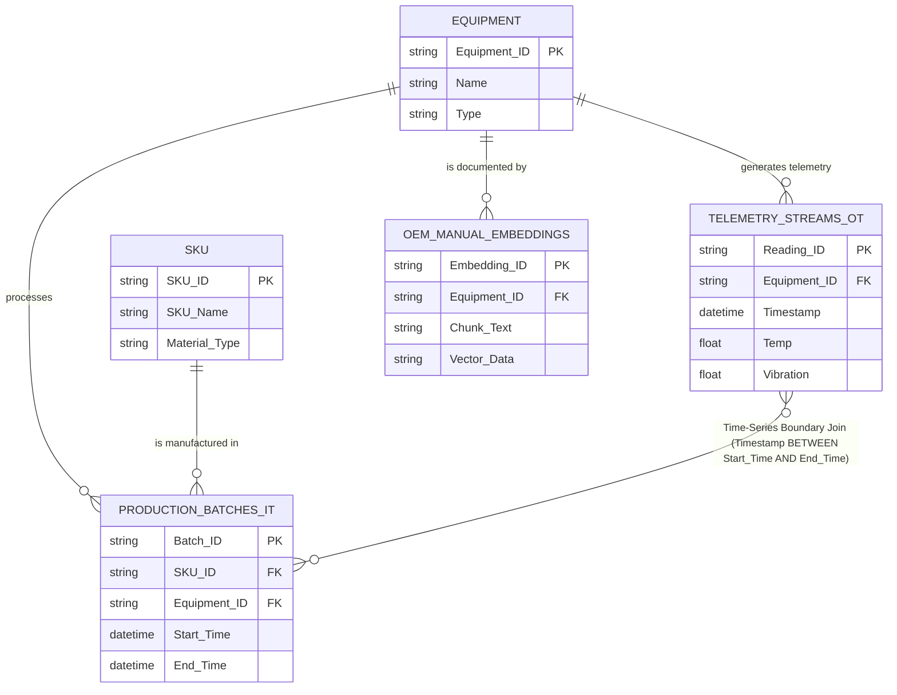
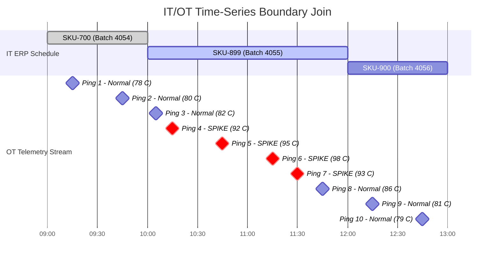

# SKU-Specific OEE Degradation Tracker

Snowflake CoCo-native prototype that converges high-frequency OT sensor streams with low-frequency IT batch schedules to identify exactly which product runs are destroying machine health.

## 1. Detailed Problem Statement

Manufacturing plants suffer from persistent unplanned downtime because physical machine telemetry (OT) and enterprise business logic (IT) operate in isolated silos. When a critical asset degrades, reliability engineers observe the physical symptoms (e.g., escalating vibration or temperature) but lack the immediate operational context (e.g., what specific product was running, which batch caused the spike, or what material was being processed). 

This disconnect prevents factories from identifying the true root cause of equipment fatigue. Consequently, plants experience recurring "micro-stoppages" and accelerated wear that destroy Overall Equipment Effectiveness (OEE) because the machinery is blindly treated for mechanical failure rather than being optimized for the specific product mix that is causing the stress.

## 2. Proposed Solution

The "SKU-Specific OEE Degradation Tracker" is a Snowflake CoCo-native prototype that converges high-frequency OT sensor streams with low-frequency IT batch schedules to identify exactly which product runs are destroying machine health.

The system continuously joins synthetic telemetry data with ERP production records to map physical asset stress directly to specific SKUs. A CoCo multi-agent orchestration workflow detects these stress patterns, predicts the asset's Remaining Useful Life (RUL), and investigates the root cause. It extracts maximum operational limits from unstructured OEM equipment manuals to validate the anomaly, and finally uses a Model Context Protocol (MCP) connector to automatically trigger a mitigation alert in Slack, turning an obscure machine warning into an automated, business-aware supply chain action.

## 3. Compatibility Review with Challenge Rubrics

This prototype is meticulously reverse-engineered to score maximum points across the specified judging criteria:

*   **IT/OT Convergence:** Merges real-time sensor streams (OT) with ERP schedule records (IT) via a time-series boundary join in Snowflake Dynamic Tables.
*   **Predict Failures & Natural Language Root Cause:** Implements a predictive model to forecast failure horizons and uses an Investigative Agent to explain the SKU-to-degradation correlation in conversational text.
*   **Command Center & Action:** Deploys a CoCo-scaffolded Streamlit app allowing plant managers to triage alerts and trigger cross-tool actions.
*   **Synthetic Data Generation:** Uses CoCo to generate referentially consistent IT and OT datasets, avoiding the need for actual production data.
*   **Semantic Model & Ontology:** Authors a unified semantic view linking physical assets to business batches, validated against natural language queries.
*   **Unstructured Processing:** Parses and extracts thermal/vibration constraints from unstructured PDF equipment manuals to ground the agent's reasoning.

### Ingenuity Bonuses Captured:
*   **MCP Connectors:** Wires the Execution Agent to a local Slack MCP server.
*   **Multi-Agent Orchestration:** Coordinates Diagnostic, Investigative, and Execution agents with explicit JSON state handoffs.
*   **Reusable Skills:** Packages the complex IT/OT time-series SQL join as a distinctly documented, publishable CoCo skill.

## 4 & 5. Phase-Wise Project Plan & System Analysis WBS

This Work Breakdown Structure decomposes the prototype lifecycle into incrementally achievable goals.

### Phase 1: Foundation (Data & Pipelines)
**Goal:** Generate consistent factory floor data and establish the transformation pipelines.
*   **Task 1.1:** Write a Python script to continuously generate synthetic OT data (`Timestamp`, `Equipment_ID`, `Temp`, `Vibration`) and stream it into a raw Snowflake table. Program explicit 15% temperature spikes.
*   **Task 1.2:** Write a script to generate synthetic IT data (`Batch_ID`, `SKU_ID`, `Equipment_ID`, `Start_Time`, `End_Time`). Ensure the time blocks for "SKU-899" perfectly overlap with the OT temperature spikes.
*   **Task 1.3:** Build a Snowflake Dynamic Table that executes a `BETWEEN` join, mapping the OT timestamps squarely inside the IT batch duration blocks. Package this SQL as a CoCo Reusable Skill.

### Phase 2: Predictive Modeling & Semantic Ontology
**Goal:** Define the predictive methodology and structure the data for natural language interactions.
*   **Task 2.1 (Predictive Model Selection):**
    *   **Option A:** Snowflake ML Forecasting *(Medium Difficulty, High Value)*. Use Snowflake Cortex ML functions to forecast the OT metric trajectory based on the SKU schedule.
    *   **Option B:** SQL Rule-Based RUL *(Low Difficulty, Rigid)*. Write a view that calculates failure in X hours if the current `Temp > Threshold`.
    *   **Option C:** LLM Reasoning *(Low Difficulty, High Risk)*. Prompt an agent to estimate RUL based on the data. *(Recommendation: Option A or B for reliable prototype execution).*
*   **Task 2.2:** Use the CoCo CLI to generate a Semantic Model on top of the joined dynamic tables. Explicitly define the relationships between assets and SKUs in the ontology.

### Phase 3: Unstructured Knowledge & Multi-Agent Orchestration
**Goal:** Inject OEM constraints and coordinate the AI reasoning workflow.
*   **Task 3.1:** Upload a mock PDF equipment manual. Use CoCo's unstructured processing to chunk, vectorize, and index the document in Snowflake, linking it to the `Equipment_ID`.
*   **Task 3.2:** Configure the Diagnostic Agent to monitor the semantic model for the predictive failure threshold.
*   **Task 3.3:** Configure the Investigative Agent to receive the failure flag, query the semantic model to identify the active SKU during the degradation, and query the PDF manual to validate the OEM limits.
*   **Task 3.4:** Configure the Execution Agent to receive the final JSON payload containing the SKU, the predicted failure date, and the OEM evidence.

### Phase 4: Command Center UI & MCP Integration
**Goal:** Build the interactive frontend and automate the external Slack action.
*   **Task 4.1:** Install the official Slack MCP server locally in Anigravity IDE and authenticate it.
*   **Task 4.2:** Use CoCo to scaffold the Streamlit app. Build a UI displaying the joined IT/OT data grid alongside a chat interface connected to the Investigative Agent.
*   **Task 4.3:** Embed a "Mitigate Impact" button in the UI. Wire this button to invoke the Execution Agent, triggering the MCP `post_message` tool to push the automated alert into a Slack channel.

## 6. Real-World Use Case Narrative

A high-volume packaging facility runs continuous operations. At 10:00 AM, the Streamlit Command Center flashes a predictive alert: 

> *"Drive-End Bearing Failure Forecasted in 72 Hours on Line 2."*

Instead of dispatching a mechanic to blindly inspect the machine, the Plant Manager asks the Command Center, *"What is driving the thermal stress on Line 2?"* 

The Investigative Agent analyzes the IT/OT semantic model and replies: 
> *"Line 2 baseline temperature rises by 18 degrees exclusively during SKU-899 (Heavy-Duty Cardboard) batch runs. According to the OEM AX-200 manual, this sustained temperature exceeds the maximum continuous operating limit of 90°C, accelerating bearing fatigue."*

The Plant Manager clicks **"Mitigate Impact"** on the dashboard. The Execution Agent connects via MCP to the corporate Slack workspace and automatically posts a message to the `#production-planning` channel: 

> *"URGENT: SKU-899 runs are causing critical thermal stress on Line 2. Please reduce feed rate by 10% for all upcoming SKU-899 batches to preserve bearing life until scheduled weekend maintenance."*

## 7. System Architecture Diagram

## 8. Sequence Diagram for multi-agent orchestration workflow

## 9. Entity Relationship Diagram for Database Semantic Ontology

## 10. Data Flow Pipeline

---

## Crucial Prototype Setup Notes:

*   **Slack Workspace Admin Rights:** Ensure you have the necessary administrative privileges in your target Slack workspace to create an app, acquire a Bot User OAuth Token, and grant `chat:write` scopes for the MCP server.
*   **Source for Unstructured Data:** You must procure or generate a mock PDF equipment manual (e.g., a 3-page document detailing operating limits for a motor or gearbox) to ingest into Cortex for the unstructured processing requirement.