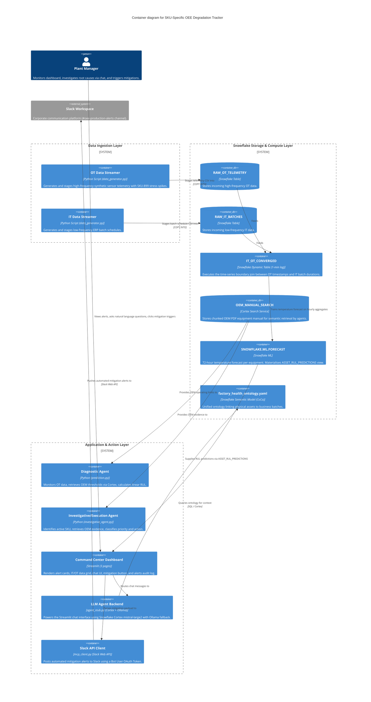
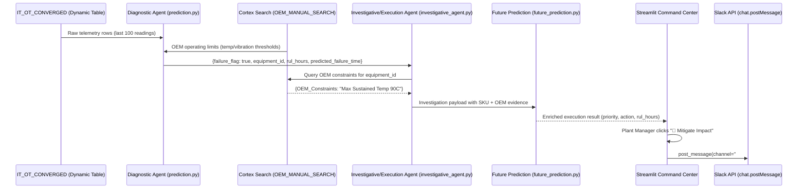
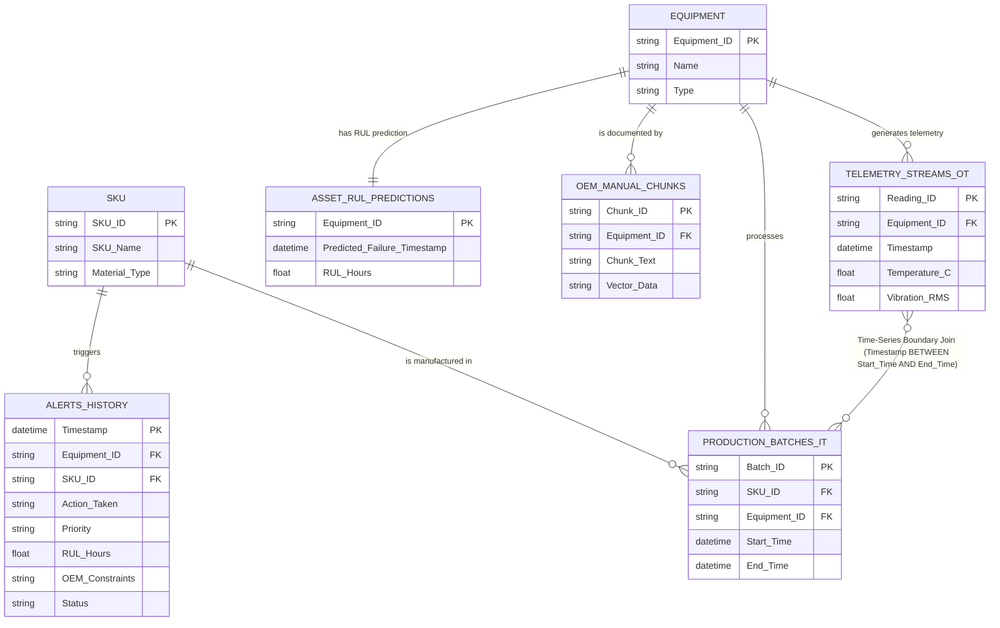
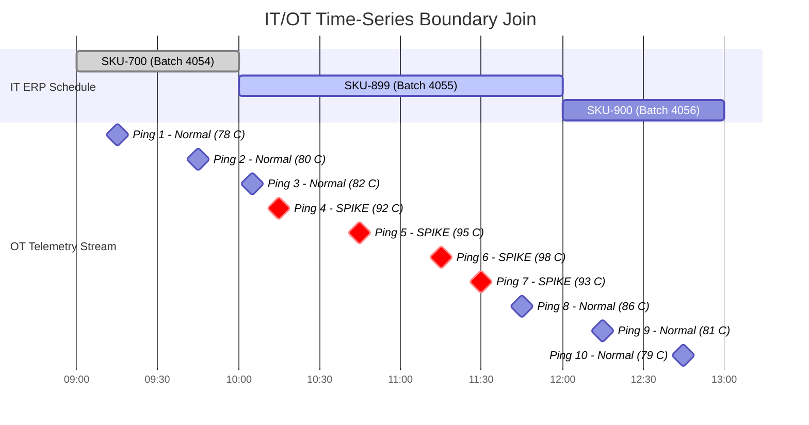

# SKU-Specific OEE Degradation Tracker

Snowflake CoCo-native prototype that converges high-frequency OT sensor streams with low-frequency IT batch schedules to identify exactly which product runs are destroying machine health.

## 1. Detailed Problem Statement

Manufacturing plants suffer from persistent unplanned downtime because physical machine telemetry (OT) and enterprise business logic (IT) operate in isolated silos. When a critical asset degrades, reliability engineers observe the physical symptoms (e.g., escalating vibration or temperature) but lack the immediate operational context (e.g., what specific product was running, which batch caused the spike, or what material was being processed). 

This disconnect prevents factories from identifying the true root cause of equipment fatigue. Consequently, plants experience recurring "micro-stoppages" and accelerated wear that destroy Overall Equipment Effectiveness (OEE) because the machinery is blindly treated for mechanical failure rather than being optimized for the specific product mix that is causing the stress.

## 2. Proposed Solution

The "SKU-Specific OEE Degradation Tracker" is a Snowflake CoCo-native prototype that converges high-frequency OT sensor streams with low-frequency IT batch schedules to identify exactly which product runs are destroying machine health.

The system continuously joins synthetic telemetry data with ERP production records to map physical asset stress directly to specific SKUs. A multi-agent Python pipeline detects these stress patterns, predicts the asset's Remaining Useful Life (RUL) using **Snowflake ML Forecasting**, and investigates the root cause. It extracts maximum operational limits from unstructured OEM equipment manuals using **Cortex Search** to validate the anomaly, and finally uses the **Slack Web API** to automatically trigger a mitigation alert in Slack, turning an obscure machine warning into an automated, business-aware supply chain action.

## 3. Compatibility Review with Challenge Rubrics

This prototype is meticulously reverse-engineered to score maximum points across the specified judging criteria:

*   **IT/OT Convergence:** Merges real-time sensor streams (OT) with ERP schedule records (IT) via a time-series boundary join in Snowflake Dynamic Tables (`IT_OT_CONVERGED`, 1-minute lag).
*   **Predict Failures & Natural Language Root Cause:** `sql/04-rul.sql` uses `SNOWFLAKE.ML.FORECAST` to forecast the OT metric trajectory 72 hours out. The Investigative Agent (backed by Snowflake Cortex `mistral-large2` + Ollama fallback) explains the SKU-to-degradation correlation in conversational text.
*   **Command Center & Action:** A 3-page Streamlit app (`code/streamlit_app/`) allows plant managers to triage alerts, investigate via chat, and trigger cross-tool Slack actions.
*   **Synthetic Data Generation:** `code/misc/data_generator.py` generates referentially consistent IT and OT datasets with a hard-coded 15% thermal and 20% vibration degradation pattern exclusively for SKU-899.
*   **Semantic Model & Ontology:** `semantic_models/factory_health_ontology.yaml` is a unified semantic view linking physical assets to business batches, exposing `PREDICTED_RUL_HOURS` and `CUMULATIVE_STRESS_SCORE` as queryable measures.
*   **Unstructured Processing:** `data/LINE-2-PACKAGING OEM Maintenance Manual.pdf` is chunked and vectorized via Cortex Search (`sql/06-cortex.sql`) and retrieved live during both the agent pipeline and Streamlit chat sessions.

### Ingenuity Bonuses Captured:
*   **Slack API Integration:** `code/streamlit_app/mcp_client.py` wires the Execution Agent directly to the Slack Web API (`chat.postMessage`) using a Bot User OAuth Token configured in `.env`.
*   **Multi-Agent Orchestration:** A two-stage pipeline coordinates a Diagnostic Agent (`prediction.py`) and an Investigative/Execution Agent (`investigative_agent.py`) with explicit JSON state handoffs. The Streamlit app exposes a third LLM agent layer (`agent_stub.py`) powered by Snowflake Cortex.
*   **Reusable Skills:** The complex IT/OT time-series SQL join is packaged as a distinctly documented, publishable CoCo Skill (`skills/IT_OT_TimeSeries_Joiner.yaml`).

## 4 & 5. Phase-Wise Project Plan & System Analysis WBS

This Work Breakdown Structure decomposes the prototype lifecycle into incrementally achievable goals.

### Phase 1: Foundation (Data & Pipelines)
**Goal:** Generate consistent factory floor data and establish the transformation pipelines.
*   **Task 1.1:** `code/misc/data_generator.py` generates synthetic OT data (`TIMESTAMP`, `EQUIPMENT_ID`, `TEMPERATURE_C`, `VIBRATION_RMS`) and exports to CSV for staging into Snowflake (`sql/02-copy.sql`). An explicit **15% temperature and 20% vibration spike** is programmed exclusively for SKU-899 batches.
*   **Task 1.2:** The same script generates synthetic IT data (`BATCH_ID`, `SKU_ID`, `EQUIPMENT_ID`, `START_TIME`, `END_TIME`) across 50 batches with 3 SKUs (SKU-100, SKU-500, SKU-899) and 30-minute changeover gaps, ensuring temporal alignment between SKU-899 runs and OT spikes.
*   **Task 1.3:** `sql/03-join.sql` creates a Snowflake Dynamic Table (`IT_OT_CONVERGED`) with `TARGET_LAG = '1 minute'` that executes a `BETWEEN` join mapping OT timestamps inside IT batch duration blocks. This SQL is also packaged as a reusable CoCo Skill in `skills/IT_OT_TimeSeries_Joiner.yaml`.

### Phase 2: Predictive Modeling & Semantic Ontology
**Goal:** Define the predictive methodology and structure the data for natural language interactions.
*   **Task 2.1 (Predictive Model — Option A Implemented):** `sql/04-rul.sql` uses `SNOWFLAKE.ML.FORECAST` to train a per-equipment temperature forecast model over hourly intervals aggregated from `IT_OT_CONVERGED`. It generates a 72-hour temperature forecast (`PREDICTED_TEMPERATURES`) and materialises an `ASSET_RUL_PREDICTIONS` view that calculates RUL in hours by finding the first timestamp where the forecast breaches a dynamic threshold (avg + 0.5 std dev). A Python-based RUL calculator (`code/execute_detection/prediction.py`) also exists as a local agent, extracting OEM thresholds live from the Cortex Search-indexed PDF.
*   **Task 2.2:** `semantic_models/factory_health_ontology.yaml` defines the Snowflake semantic model with two tables (`IT_OT_CONVERGED` and `ASSET_RUL_PREDICTIONS`), their dimensions, time-dimensions, and measures including `PREDICTED_RUL_HOURS` and `CUMULATIVE_STRESS_SCORE`.

### Phase 3: Unstructured Knowledge & Multi-Agent Orchestration
**Goal:** Inject OEM constraints and coordinate the AI reasoning workflow.
*   **Task 3.1:** `data/LINE-2-PACKAGING OEM Maintenance Manual.pdf` is the source document. `code/create_rag/parse_pdf.py` and `code/create_rag/insert_document.py` chunk and insert it into Snowflake. `sql/06-cortex.sql` creates the Cortex Search Service (`OEM_MANUAL_SEARCH`) and `sql/07-retrieval.sql` validates semantic retrieval.
*   **Task 3.2:** `code/execute_detection/prediction.py` acts as the **Diagnostic Agent**. It queries the `IT_OT_CONVERGED` table via `misc/snowflake_client.py`, extracts OEM operating limits from Cortex Search using an LLM prompt, performs linear degradation rate analysis, and emits a structured JSON failure flag payload including `rul_hours` and `predicted_failure_time`.
*   **Task 3.3:** `code/execute_detection/investigative_agent.py` acts as the **Investigative Agent**. It receives the Diagnostic Agent's JSON payload, identifies the active SKU from `IT_OT_CONVERGED`, re-queries the OEM manual for operating constraints, and classifies the alert into `priority` (CRITICAL / HIGH / MEDIUM) and `action` (IMMEDIATE_MAINTENANCE / SCHEDULE_MAINTENANCE / MONITOR_EQUIPMENT).
*   **Task 3.4:** The **Execution Agent** logic is the final stage of `investigative_agent.py` — it assembles the final JSON payload containing `equipment_id`, `sku`, `action`, `priority`, `rul_hours`, `predicted_failure_time`, and `oem_evidence`. `code/execute_detection/future_prediction.py` further enriches this with a forward-looking prediction context.
*   **Task 3.5 (Orchestration Workflow):** `code/execute_detection/detection_workflow.py` is the top-level runner that chains all stages: `predict()` → `search_oem_manual()` → `investigate()` → `future_prediction()` with explicit JSON handoffs between each stage.

### Phase 4: Command Center UI & Slack Integration
**Goal:** Build the interactive frontend and automate the external Slack action.
*   **Task 4.1:** `code/streamlit_app/mcp_client.py` implements the Slack integration using the Slack Web API (`https://slack.com/api/chat.postMessage`). Authentication uses a Bot User OAuth Token (`SLACK_BOT_TOKEN`) read from `.env`. The message is formatted with equipment ID, failure horizon, active SKU, priority, and OEM constraint details.
*   **Task 4.2:** `code/streamlit_app/app.py` is the Streamlit entry point. `pages/1_Dashboard.py` renders predictive alert cards sourced from `ASSET_RUL_PREDICTIONS` alongside the full `IT_OT_CONVERGED` data grid with equipment and SKU filters and progress-bar column renderers for Temperature and Vibration.
*   **Task 4.3:** `pages/2_Investigate.py` is the Chat UI page. It accepts context from the Dashboard (equipment, SKU, RUL), pre-fires an initial diagnostic question to `agent_stub.py` (which uses Snowflake Cortex `mistral-large2` with Ollama as fallback), and renders a full chat interface. The **"🚨 Mitigate Impact"** button calls `post_slack_alert()` and on success logs the alert to the `ALERTS_HISTORY` Snowflake table.
*   **Task 4.4:** `pages/3_Alerts_History.py` provides a full audit log of all triggered mitigation actions, displaying `EQUIPMENT_ID`, `SKU_ID`, `ACTION_TAKEN`, `PRIORITY`, `RUL_HOURS`, `OEM_CONSTRAINTS`, and `STATUS` with CSV export capability.

## 6. Real-World Use Case Narrative

A high-volume packaging facility runs continuous operations. At 10:00 AM, the Streamlit Command Center flashes a predictive alert: 

> *"Drive-End Bearing Failure Forecasted in 72 Hours on Line 2."*

Instead of dispatching a mechanic to blindly inspect the machine, the Plant Manager asks the Command Center, *"What is driving the thermal stress on Line 2?"* 

The Investigative Agent analyzes the IT/OT semantic model and replies: 
> *"Line 2 baseline temperature rises by 18 degrees exclusively during SKU-899 (Heavy-Duty Cardboard) batch runs. According to the OEM AX-200 manual, this sustained temperature exceeds the maximum continuous operating limit of 90°C, accelerating bearing fatigue."*

The Plant Manager clicks **"🚨 Mitigate Impact"** on the dashboard. The Execution Agent connects via the Slack Web API to the corporate Slack workspace and automatically posts a message to the `#oee-production-alerts` channel: 

> *"🚨 URGENT: SKU-899 runs are causing critical thermal stress on LINE-2-PACKAGING. Predicted bearing failure in 72 hours. OEM Limit: Max Sustained Temp 90°C. ACTION REQUIRED: Reduce feed rate by 10% for all upcoming SKU-899 batches."*

## 7. System Architecture Diagram


```mermaid
C4Container
title Container diagram for SKU-Specific OEE Degradation Tracker

Person(manager, "Plant Manager", "Monitors dashboard, investigates root causes via chat, and triggers mitigations.")

System_Boundary(ingestion, "Data Ingestion Layer") {
    Container(ot_stream, "OT Data Streamer", "Python Script (data_generator.py)", "Generates and stages high-frequency synthetic sensor telemetry with SKU-899 stress spikes.")
    Container(it_stream, "IT Data Streamer", "Python Script (data_generator.py)", "Generates and stages low-frequency ERP batch schedules.")
}

System_Boundary(snowflake, "Snowflake Storage & Compute Layer") {
    ContainerDb(raw_ot, "RAW_OT_TELEMETRY", "Snowflake Table", "Stores incoming high-frequency OT data.")
    ContainerDb(raw_it, "RAW_IT_BATCHES", "Snowflake Table", "Stores incoming low-frequency IT data.")
    Container(dynamic_tables, "IT_OT_CONVERGED", "Snowflake Dynamic Table (1-min lag)", "Executes the time-series boundary join between OT timestamps and IT batch durations.")
    ContainerDb(cortex_vector, "OEM_MANUAL_SEARCH", "Cortex Search Service", "Stores chunked OEM PDF equipment manual for semantic retrieval by agents.")
    Container(ml_forecast, "SNOWFLAKE.ML.FORECAST", "Snowflake ML", "72-hour temperature forecast per equipment. Materialises ASSET_RUL_PREDICTIONS view.")
    Container(semantic_layer, "factory_health_ontology.yaml", "Snowflake Semantic Model (CoCo)", "Unified ontology linking physical assets to business batches.")
}

System_Boundary(app_action, "Application & Action Layer") {
    Container(diagnostic, "Diagnostic Agent", "Python (prediction.py)", "Monitors OT data, retrieves OEM thresholds via Cortex, calculates linear RUL.")
    Container(investigative, "Investigative/Execution Agent", "Python (investigative_agent.py)", "Identifies active SKU, retrieves OEM evidence, classifies priority and action.")
    Container(streamlit_app, "Command Center Dashboard", "Streamlit (3 pages)", "Renders alert cards, IT/OT data grid, chat UI, mitigation button, and alerts audit log.")
    Container(agent_stub, "LLM Agent Backend", "agent_stub.py (Cortex + Ollama)", "Powers the Streamlit chat interface using Snowflake Cortex mistral-large2 with Ollama fallback.")
    Container(slack_client, "Slack API Client", "mcp_client.py (Slack Web API)", "Posts automated mitigation alerts to Slack using a Bot User OAuth Token.")
}

System_Ext(slack_workspace, "Slack Workspace", "Corporate communication platform (#oee-production-alerts channel).")

Rel(ot_stream, raw_ot, "Stages telemetry CSV into", "COPY INTO")
Rel(it_stream, raw_it, "Stages batch schedule CSV into", "COPY INTO")

Rel(raw_ot, dynamic_tables, "Feeds")
Rel(raw_it, dynamic_tables, "Feeds")

Rel(dynamic_tables, ml_forecast, "Trains temperature forecast on hourly aggregates")
Rel(ml_forecast, streamlit_app, "Supplies RUL predictions via ASSET_RUL_PREDICTIONS")
Rel(cortex_vector, diagnostic, "Provides OEM operating limits to")
Rel(cortex_vector, investigative, "Provides OEM evidence to")

Rel(manager, streamlit_app, "Views alerts, asks natural language questions, clicks mitigation triggers")
Rel(streamlit_app, agent_stub, "Routes chat messages to")
Rel(agent_stub, semantic_layer, "Queries ontology for context", "SQL / Cortex")
Rel(streamlit_app, slack_client, "Passes mitigation payload to")

Rel(slack_client, slack_workspace, "Pushes automated mitigation alerts to", "Slack Web API")
```
## 8. Sequence Diagram for Multi-Agent Orchestration Workflow


```mermaid
sequenceDiagram
    participant OT as IT_OT_CONVERGED (Dynamic Table)
    participant DA as Diagnostic Agent (prediction.py)
    participant CS as Cortex Search (OEM_MANUAL_SEARCH)
    participant IA as Investigative/Execution Agent (investigative_agent.py)
    participant FP as Future Prediction (future_prediction.py)
    participant UI as Streamlit Command Center
    participant SA as Slack API (chat.postMessage)

    OT->>DA: Raw telemetry rows (last 100 readings)
    CS->>DA: OEM operating limits (temp/vibration thresholds)
    DA->>IA: {failure_flag: true, equipment_id, rul_hours, predicted_failure_time}
    
    IA->>CS: Query OEM constraints for equipment_id
    CS-->>IA: {OEM_Constraints: "Max Sustained Temp 90C"}
    
    IA->>FP: Investigation payload with SKU + OEM evidence
    FP-->>UI: Enriched execution result (priority, action, rul_hours)
    
    UI->>UI: Plant Manager clicks "🚨 Mitigate Impact"
    UI->>SA: post_message(channel="#oee-production-alerts", text="URGENT: SKU-899...")
```
## 9. Entity Relationship Diagram for Database Semantic Ontology


```mermaid
erDiagram
    EQUIPMENT {
        string Equipment_ID PK
        string Name
        string Type
    }

    SKU {
        string SKU_ID PK
        string SKU_Name
        string Material_Type
    }

    TELEMETRY_STREAMS_OT {
        string Reading_ID PK
        string Equipment_ID FK
        datetime Timestamp
        float Temperature_C
        float Vibration_RMS
    }

    PRODUCTION_BATCHES_IT {
        string Batch_ID PK
        string SKU_ID FK
        string Equipment_ID FK
        datetime Start_Time
        datetime End_Time
    }

    OEM_MANUAL_CHUNKS {
        string Chunk_ID PK
        string Equipment_ID FK
        string Chunk_Text
        string Vector_Data
    }

    ASSET_RUL_PREDICTIONS {
        string Equipment_ID PK
        datetime Predicted_Failure_Timestamp
        float RUL_Hours
    }

    ALERTS_HISTORY {
        datetime Timestamp PK
        string Equipment_ID FK
        string SKU_ID FK
        string Action_Taken
        string Priority
        float RUL_Hours
        string OEM_Constraints
        string Status
    }

    EQUIPMENT ||--o{ TELEMETRY_STREAMS_OT : "generates telemetry"
    EQUIPMENT ||--o{ PRODUCTION_BATCHES_IT : "processes"
    EQUIPMENT ||--o{ OEM_MANUAL_CHUNKS : "is documented by"
    EQUIPMENT ||--|| ASSET_RUL_PREDICTIONS : "has RUL prediction"
    SKU ||--o{ PRODUCTION_BATCHES_IT : "is manufactured in"
    SKU ||--o{ ALERTS_HISTORY : "triggers"

    %% IT/OT Convergence Logical Join (Snowflake Dynamic Tables)
    TELEMETRY_STREAMS_OT }o--o{ PRODUCTION_BATCHES_IT : "Time-Series Boundary Join (Timestamp BETWEEN Start_Time AND End_Time)"
```
## 10. Data Flow Pipeline


```mermaid
gantt
    title IT/OT Time-Series Boundary Join
    dateFormat  YYYY-MM-DD HH:mm
    axisFormat  %H:%M

    section IT ERP Schedule
    SKU-700 (Batch 4054)     :done, 2026-09-22 09:00, 2026-09-22 10:00
    SKU-899 (Batch 4055)     :active, 2026-09-22 10:00, 2026-09-22 12:00
    SKU-900 (Batch 4056)     :2026-09-22 12:00, 2026-09-22 13:00

    section OT Telemetry Stream
    Ping 1 - Normal (78 C)   :milestone, 2026-09-22 09:15, 0m
    Ping 2 - Normal (80 C)   :milestone, 2026-09-22 09:45, 0m
    Ping 3 - Normal (82 C)   :milestone, 2026-09-22 10:05, 0m
    Ping 4 - SPIKE (92 C)    :milestone, crit, 2026-09-22 10:15, 0m
    Ping 5 - SPIKE (95 C)    :milestone, crit, 2026-09-22 10:45, 0m
    Ping 6 - SPIKE (98 C)    :milestone, crit, 2026-09-22 11:15, 0m
    Ping 7 - SPIKE (93 C)    :milestone, crit, 2026-09-22 11:30, 0m
    Ping 8 - Normal (86 C)   :milestone, 2026-09-22 11:45, 0m
    Ping 9 - Normal (81 C)   :milestone, 2026-09-22 12:15, 0m
    Ping 10 - Normal (79 C)  :milestone, 2026-09-22 12:45, 0m
```
---

## 11. Project File Structure

```
SKU-Specific-OEE-Degradation-Tracker/
├── .env                          # Snowflake + Slack credentials (not committed)
├── requirements.txt              # Python dependencies
├── data/
│   ├── LINE-2-PACKAGING OEM Maintenance Manual.pdf  # Source OEM manual
│   ├── device_data.csv           # Sample device data for local testing
│   ├── it_batch_schedule.csv     # Generated IT data (output of data_generator.py)
│   └── ot_telemetry_stream.csv   # Generated OT data (output of data_generator.py)
├── sql/
│   ├── 01-init.sql               # Database, schema, warehouse setup
│   ├── 02-copy.sql               # COPY INTO staging for CSV files
│   ├── 03-join.sql               # Dynamic Table IT_OT_CONVERGED (BETWEEN join)
│   ├── 04-rul.sql                # Snowflake ML Forecast + ASSET_RUL_PREDICTIONS view
│   ├── 04-oem.sql                # OEM reference table setup
│   ├── 05-parse.sql              # Document parsing setup
│   ├── 06-cortex.sql             # Cortex Search Service (OEM_MANUAL_SEARCH)
│   ├── 07-retrieval.sql          # Retrieval validation queries
│   ├── 08-alerts.sql             # ALERTS_HISTORY table DDL
│   └── 09-semantic-models.sql    # Semantic model registration
├── semantic_models/
│   └── factory_health_ontology.yaml  # CoCo Semantic Model ontology
├── skills/
│   └── IT_OT_TimeSeries_Joiner.yaml  # Reusable CoCo Skill for BETWEEN join
└── code/
    ├── misc/
    │   ├── data_generator.py     # Generates synthetic IT + OT CSV data
    │   └── snowflake_client.py   # Snowflake connector + Cortex Search utilities
    ├── create_rag/
    │   ├── parse_pdf.py          # PDF chunking logic
    │   ├── insert_document.py    # Inserts PDF chunks into Snowflake
    │   └── create_rag_workflow.py # RAG pipeline orchestrator
    ├── llm_setup/
    │   └── llm.py                # Ollama LLM client (mistral/llama3, local fallback)
    ├── semantic_model_code/
    │   └── semantic_model_deployment.py  # Deploys semantic model to Snowflake
    ├── execute_detection/
    │   ├── prediction.py         # Diagnostic Agent: RUL calculation + threshold breach
    │   ├── investigative_agent.py # Investigative/Execution Agent: SKU ID + OEM evidence
    │   ├── future_prediction.py  # Enriches execution payload with forward prediction
    │   └── detection_workflow.py # Top-level runner: chains all agent stages
    └── streamlit_app/
        ├── app.py                # Streamlit entry point
        ├── agent_stub.py         # LLM agent backend (Cortex + Ollama)
        ├── mcp_client.py         # Slack Web API client (chat.postMessage)
        ├── snowflake_conn.py     # Snowflake session manager for Streamlit
        └── pages/
            ├── 1_Dashboard.py    # Alert cards + IT/OT converged data grid
            ├── 2_Investigate.py  # Chat UI + "🚨 Mitigate Impact" button
            └── 3_Alerts_History.py # Audit log of all triggered mitigations
```

---

## Crucial Prototype Setup Notes

*   **Snowflake Credentials:** Populate `.env` with `SNOWFLAKE_ACCOUNT`, `SNOWFLAKE_USER`, `SNOWFLAKE_PASSWORD`, `SNOWFLAKE_DATABASE` (`OEE_COMMAND_CENTER`), `SNOWFLAKE_SCHEMA` (`FACTORY_FLOOR`), and `SNOWFLAKE_WAREHOUSE` (`COMPUTE_WH`).
*   **Slack Integration:** Set `SLACK_BOT_TOKEN` (a `xoxb-...` Bot User OAuth Token) and `SLACK_CHANNEL` in `.env`. Ensure the Slack app has `chat:write` scope enabled in your workspace.
*   **SQL Execution Order:** Run SQL scripts sequentially: `01-init.sql` → `02-copy.sql` → `03-join.sql` → `04-rul.sql` → `04-oem.sql` → `05-parse.sql` → `06-cortex.sql` → `07-retrieval.sql` → `08-alerts.sql`.
*   **ML Forecast Training:** `sql/04-rul.sql` trains `SNOWFLAKE.ML.FORECAST` — this requires sufficient historical data in `IT_OT_CONVERGED` (at least a few hundred rows spanning multiple hours). Run `data_generator.py` and `02-copy.sql` first.
*   **Cortex Search Service:** `sql/06-cortex.sql` must be run after PDF chunks are inserted via `code/create_rag/insert_document.py`. This creates the `OEM_MANUAL_SEARCH` Cortex Search Service used by both agent pipelines and the Streamlit chat agent.
*   **Ollama (Local LLM Fallback):** `code/llm_setup/llm.py` connects to a local Ollama instance (`http://localhost:11434`). If Snowflake Cortex is unavailable for local testing, install Ollama and pull `mistral` or `llama3` to enable the fallback path.
*   **OEM Manual Ingestion:** `data/LINE-2-PACKAGING OEM Maintenance Manual.pdf` must be ingested via `code/create_rag/insert_document.py` before the agents can retrieve OEM operating limits.