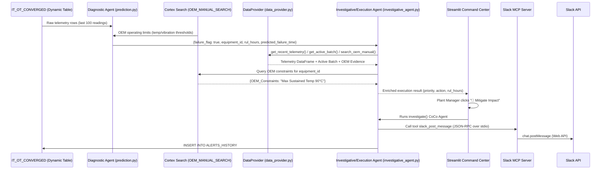
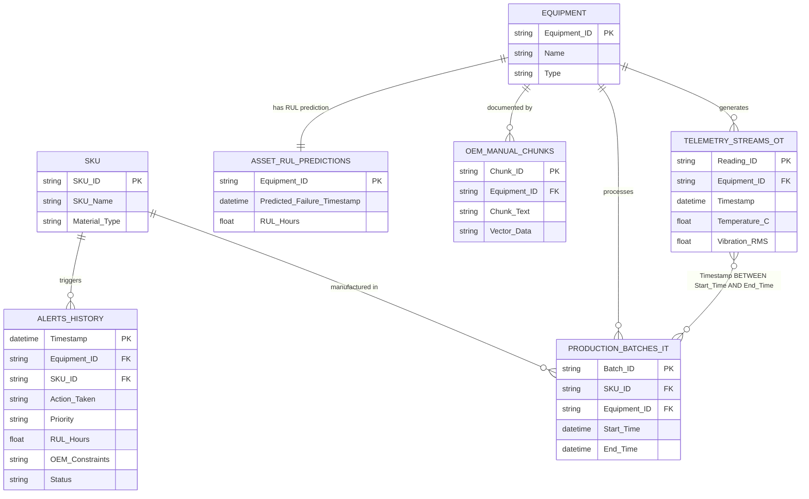

# SKU-Specific OEE Degradation Tracker

A Snowflake CoCo-native prototype that converges high-frequency OT sensor streams with low-frequency IT batch schedules to identify which product runs are destroying machine health — and autonomously mitigates the risk via Slack.

---

## 1. Problem Statement

Manufacturing plants suffer from persistent unplanned downtime because physical machine telemetry (OT) and enterprise business logic (IT) operate in isolated silos. When a critical asset degrades, reliability engineers observe the physical symptoms (escalating vibration or temperature) but lack the operational context: which product was running, which batch caused the spike, or what material was being processed.

This disconnect prevents factories from identifying the true root cause of equipment fatigue. Plants experience recurring "micro-stoppages" and accelerated wear that destroy Overall Equipment Effectiveness (OEE) because machinery is blindly treated for mechanical failure rather than being optimized for the specific product mix causing the stress.

---

## 2. Solution

The SKU-Specific OEE Degradation Tracker is a Snowflake CoCo-native prototype that:

- **Converges** high-frequency OT sensor telemetry with low-frequency IT batch schedules via a Snowflake Dynamic Table with 1-minute lag (`IT_OT_CONVERGED`)
- **Predicts** asset Remaining Useful Life (RUL) using `SNOWFLAKE.ML.FORECAST` over a 72-hour temperature trajectory
- **Investigates** root causes by extracting OEM equipment limits from unstructured manuals via **Cortex Search**
- **Mitigates** automatically — the Slack MCP server posts structured alerts to `#oee-production-alerts` without human intervention
- **Operates autonomously** via a background daemon polling RUL predictions every minute

---

## 3. Challenge Rubric Alignment

| Criterion | Implementation |
|---|---|
| **IT/OT Convergence** | `sql/03-join.sql` + Dynamic Table `IT_OT_CONVERGED` (1-min lag) via `TIMESTAMP BETWEEN START_TIME AND END_TIME` join |
| **Predict Failures & Root Cause** | `SNOWFLAKE.ML.FORECAST` (72-hr trajectory) + Diagnostic Agent (`prediction.py`) with Cortex-retrieved OEM thresholds |
| **Command Center & Action** | 4-page Streamlit app: Dashboard, Investigative Agent chat, Alerts History, Data Analyst (Cortex Analyst) |
| **Synthetic Data** | `code/misc/data_generator.py` — referentially consistent IT/OT data with a hard-coded 15% temp / 20% vibration spike exclusive to SKU-899 |
| **Semantic Model & Ontology** | `semantic_models/factory_health_ontology.yaml` — CoCo semantic view linking assets, batches, `PREDICTED_RUL_HOURS`, `CUMULATIVE_STRESS_SCORE` |
| **Unstructured Processing** | `data/OEM_Maintenance_and_Operations_Manual.pdf` chunked and vectorized by Cortex Search (`sql/04-cortex-search.sql`) |
| **Reusable Skill** | `.cortex/skills/it-ot-timeseries-joiner/SKILL.md` — CoCo CLI skill documenting the IT/OT time-series boundary join |
| **Slack MCP Integration** | `@modelcontextprotocol/server-slack` spawned as a stdio subprocess; replaces legacy HTTP API calls |
| **Autonomous Operations** | `code/execute_detection/autonomous_daemon.py` — continuous background monitor |
| **Multi-Agent Orchestration** | Diagnostic Agent → Investigative Agent → Execution Agent pipeline with Pydantic-validated JSON handoffs |

---

## 4. System Architecture


```mermaid
C4Container
title Container diagram for SKU-Specific OEE Degradation Tracker

Person(manager, "Plant Manager", "Monitors dashboard, investigates root causes via chat, and triggers mitigations.")

System_Boundary(ingestion, "Data Ingestion Layer") {
    Container(data_gen, "Data Generator", "Python (data_generator.py)", "Generates referentially consistent IT/OT synthetic CSV data with SKU-899 stress spikes.")
}

System_Boundary(snowflake, "Snowflake Storage & Compute Layer") {
    ContainerDb(raw_ot, "RAW_OT_TELEMETRY", "Snowflake Table", "High-frequency OT sensor readings.")
    ContainerDb(raw_it, "RAW_IT_BATCHES", "Snowflake Table", "Low-frequency IT ERP batch schedules.")
    Container(dynamic_tables, "IT_OT_CONVERGED", "Snowflake Dynamic Table (1-min lag)", "Time-series boundary join: OT TIMESTAMP BETWEEN IT START_TIME AND END_TIME.")
    ContainerDb(cortex_vector, "OEM_MANUAL_SEARCH", "Cortex Search Service", "Chunked OEM PDF manual for semantic retrieval.")
    Container(ml_forecast, "SNOWFLAKE.ML.FORECAST", "Snowflake ML", "72-hour temperature forecast → ASSET_RUL_PREDICTIONS view.")
    ContainerDb(alerts_db, "ALERTS_HISTORY", "Snowflake Table", "Audit log of all triggered mitigation actions.")
    Container(semantic_layer, "factory_health_ontology.yaml", "Snowflake Semantic Model (CoCo)", "Unified ontology linking physical assets to business batches.")
}

System_Boundary(app_action, "Application & Action Layer") {
    Container(wizard, "Setup Wizard", "Python (wizard.py)", "Zero-click credential gating: blocks app access until Snowflake + Slack are configured.")
    Container(diagnostic, "Diagnostic Agent", "Python (prediction.py)", "Queries IT_OT_CONVERGED, retrieves OEM thresholds via Cortex, calculates linear RUL.")
    Container(investigative, "Investigative/Execution Agent", "Python (investigative_agent.py)", "Identifies active SKU, retrieves OEM evidence, classifies priority and dispatches Slack alert.")
    Container(data_provider, "DataProvider Abstraction", "Python (data_provider.py)", "SnowflakeDataProvider / MockDataProvider — decouples agent logic from live Snowflake for offline testing.")
    Container(autonomous_daemon, "Autonomous Daemon", "Python (autonomous_daemon.py)", "Background monitor polling predictions and triggering workflow automatically.")
    Container(streamlit_app, "Command Center", "Streamlit (4 pages + wizard)", "Alert cards, IT/OT grid, chat UI, mitigation button, alerts audit log, data analyst playground.")
    Container(agent_stub, "LLM Agent Backend", "agent_stub.py (Ollama/Cortex)", "Powers Streamlit chat using local Ollama or Snowflake Cortex.")
    Container(mcp_server, "Slack MCP Server", "Node.js (@modelcontextprotocol/server-slack)", "Posts mitigation alerts to Slack via MCP JSON-RPC over stdio.")
}

System_Ext(slack_workspace, "Slack Workspace", "#oee-production-alerts channel.")

Rel(data_gen, raw_ot, "Stages OT CSV via COPY INTO")
Rel(data_gen, raw_it, "Stages IT CSV via COPY INTO")
Rel(raw_ot, dynamic_tables, "Feeds")
Rel(raw_it, dynamic_tables, "Feeds")
Rel(dynamic_tables, ml_forecast, "Trains temperature forecast on hourly aggregates")
Rel(ml_forecast, streamlit_app, "Supplies RUL predictions via ASSET_RUL_PREDICTIONS")
Rel(cortex_vector, diagnostic, "Provides OEM operating limits")
Rel(cortex_vector, investigative, "Provides OEM evidence")
Rel(ml_forecast, autonomous_daemon, "Daemon polls predictions")
Rel(autonomous_daemon, investigative, "Triggers workflow")
Rel(manager, streamlit_app, "Views alerts, asks questions, clicks mitigation triggers")
Rel(streamlit_app, wizard, "Credential gating on startup")
Rel(streamlit_app, agent_stub, "Routes chat messages")
Rel(streamlit_app, investigative, "Passes UI context to CoCo Agent")
Rel(streamlit_app, data_provider, "Demo Mode injects MockDataProvider")
Rel(investigative, data_provider, "Reads telemetry + OEM data via")
Rel(investigative, mcp_server, "Invokes slack_post_message via MCP stdio")
Rel(investigative, alerts_db, "Logs mitigation to ALERTS_HISTORY")
Rel(mcp_server, slack_workspace, "Pushes alert via Slack Web API")
```

---

## 5. Multi-Agent Orchestration Sequence


```mermaid
sequenceDiagram
    participant OT as IT_OT_CONVERGED (Dynamic Table)
    participant DA as Diagnostic Agent (prediction.py)
    participant CS as Cortex Search (OEM_MANUAL_SEARCH)
    participant DP as DataProvider (data_provider.py)
    participant IA as Investigative/Execution Agent (investigative_agent.py)
    participant UI as Streamlit Command Center
    participant MCP as Slack MCP Server
    participant Slack as Slack API

    OT->>DA: Raw telemetry rows (last 100 readings)
    CS->>DA: OEM operating limits (temp/vibration thresholds)
    DA->>IA: {failure_flag: true, equipment_id, rul_hours, predicted_failure_time}
    
    IA->>DP: get_recent_telemetry() / get_active_batch() / search_oem_manual()
    DP-->>IA: Telemetry DataFrame + Active Batch + OEM Evidence
    
    IA->>CS: Query OEM constraints for equipment_id
    CS-->>IA: {OEM_Constraints: "Max Sustained Temp 90°C"}
    
    IA-->>UI: Enriched execution result (priority, action, rul_hours)
    
    UI->>UI: Plant Manager clicks "🚨 Mitigate Impact"
    UI->>IA: Runs investigate() CoCo Agent
    IA->>MCP: Call tool slack_post_message (JSON-RPC over stdio)
    MCP->>Slack: chat.postMessage (Web API)
    IA->>OT: INSERT INTO ALERTS_HISTORY
```

---

## 6. Database Schema (ER Diagram)


```mermaid
erDiagram
    EQUIPMENT {
        string Equipment_ID PK
        string Name
        string Type
    }
    SKU {
        string SKU_ID PK
        string SKU_Name
        string Material_Type
    }
    TELEMETRY_STREAMS_OT {
        string Reading_ID PK
        string Equipment_ID FK
        datetime Timestamp
        float Temperature_C
        float Vibration_RMS
    }
    PRODUCTION_BATCHES_IT {
        string Batch_ID PK
        string SKU_ID FK
        string Equipment_ID FK
        datetime Start_Time
        datetime End_Time
    }
    OEM_MANUAL_CHUNKS {
        string Chunk_ID PK
        string Equipment_ID FK
        string Chunk_Text
        string Vector_Data
    }
    ASSET_RUL_PREDICTIONS {
        string Equipment_ID PK
        datetime Predicted_Failure_Timestamp
        float RUL_Hours
    }
    ALERTS_HISTORY {
        datetime Timestamp PK
        string Equipment_ID FK
        string SKU_ID FK
        string Action_Taken
        string Priority
        float RUL_Hours
        string OEM_Constraints
        string Status
    }

    EQUIPMENT ||--o{ TELEMETRY_STREAMS_OT : "generates"
    EQUIPMENT ||--o{ PRODUCTION_BATCHES_IT : "processes"
    EQUIPMENT ||--o{ OEM_MANUAL_CHUNKS : "documented by"
    EQUIPMENT ||--|| ASSET_RUL_PREDICTIONS : "has RUL prediction"
    SKU ||--o{ PRODUCTION_BATCHES_IT : "manufactured in"
    SKU ||--o{ ALERTS_HISTORY : "triggers"
    TELEMETRY_STREAMS_OT }o--o{ PRODUCTION_BATCHES_IT : "Timestamp BETWEEN Start_Time AND End_Time"
```

---

## 7. Project File Structure

```text
SKU-Specific-OEE-Degradation-Tracker/
├── .env                              # Snowflake + Slack credentials (not committed)
├── .mcp.json                          # MCP server configuration (Slack, Memory, Filesystem)
├── requirements.txt                  # Python dependencies
├── bootstrap.py                      # Zero-click setup: venv, pip, npm, ollama
├── start.bat                         # Windows launcher → runs bootstrap.py
├── start.sh                          # macOS/Linux launcher → runs bootstrap.py
│
├── data/
│   └── OEM_Maintenance_and_Operations_Manual.pdf  # Source OEM manual for Cortex Search
│
├── sql/
│   ├── 01-infrastructure.sql         # Database, schema, warehouse setup + Dynamic Table IT_OT_CONVERGED
│   ├── 02-data-ingestion.sql         # COPY INTO staging for CSV files
│   ├── 03-analytics.sql              # ML Forecast models + ASSET_RUL_PREDICTIONS view
│   └── 04-cortex-search.sql          # Cortex Search Service (OEM_MANUAL_SEARCH)
│
├── semantic_models/
│   └── factory_health_ontology.yaml  # CoCo Semantic Model: assets, batches, RUL measures
│
├── .cortex/                          # CoCo CLI project configuration
│   ├── settings.json                 # Project-level settings (Snowflake context, semantic models)
│   ├── hooks.json                    # Security hooks blocking destructive SQL on production tables
│   ├── skills/
│   │   ├── it-ot-timeseries-joiner/  # Reusable skill: IT/OT boundary join pattern
│   │   │   └── SKILL.md
│   │   ├── oem-threshold-extractor/  # Reusable skill: OEM threshold retrieval
│   │   │   └── SKILL.md
│   │   └── rul-prediction/           # Reusable skill: RUL prediction pipeline
│   │       └── SKILL.md
│   ├── commands/                     # Custom slash commands
│   │   ├── deploy-infrastructure.md
│   │   ├── generate-data.md
│   │   └── run-detection.md
│   └── plans/
│       └── plan_2026-10-02_1102.md   # Development plan
│
├── tests/
│   └── test_oee_tracker.py           # pytest suite: SQL rendering, Pydantic guardrails, MockDataProvider decoupling, referential integrity
│
└── code/
    ├── misc/
    │   ├── data_generator.py         # Generates synthetic IT + OT CSV data
    │   └── snowflake_client.py       # Snowflake connector + Cortex Search utilities
    ├── create_rag/
    │   ├── parse_pdf.py              # PDF chunking logic
    │   ├── insert_document.py        # Inserts PDF chunks into Snowflake
    │   └── create_rag_workflow.py    # RAG pipeline orchestrator
    ├── llm_setup/
    │   └── llm.py                    # Ollama LLM client (mistral, local fallback)
    ├── semantic_model_code/
    │   └── semantic_model_deployment.py  # Deploys semantic model to Snowflake
    ├── execute_detection/
    │   ├── data_provider.py          # DataProvider abstraction: SnowflakeDataProvider / MockDataProvider (no Snowflake required for testing)
    │   ├── prediction.py             # Diagnostic Agent: RUL calculation + threshold breach
    │   ├── investigative_agent.py    # Investigative/Execution Agent: SKU ID + OEM + Slack
    │   ├── future_prediction.py      # Enriches execution payload with forward prediction
    │   ├── autonomous_daemon.py      # Background daemon polling RUL predictions
    │   ├── schemas.py                # Pydantic v2 schemas for agent handoffs (extra="forbid")
    │   └── detection_workflow.py     # Top-level runner: chains all agent stages
    └── streamlit_app/
        ├── app.py                    # Streamlit entry point + Infrastructure Setup tab
        ├── wizard.py                 # Setup wizard: credential gating + SQL deployment UI
        ├── agent_stub.py             # LLM agent backend (Cortex + Ollama fallback)
        ├── snowflake_conn.py         # Snowflake session manager for Streamlit
        └── pages/
            ├── 1_Dashboard.py        # Alert cards + converged IT/OT data grid with filters
            ├── 2_Investigate.py      # Chat UI + Demo Mode toggle + "🚨 Mitigate Impact"
            ├── 3_Alerts_History.py   # Audit log of all triggered mitigation actions
            └── 4_Data_Analyst.py     # Cortex Analyst Playground for semantic model interaction
```

---

## 8. Getting Started

### Prerequisites

| Dependency | Purpose |
|---|---|
| Python 3.9+ | Core runtime |
| Node.js + npm | Slack MCP Server (`@modelcontextprotocol/server-slack`) |
| Ollama (optional) | Local LLM fallback — `llama3.2:latest` pulled automatically by `bootstrap.py` |
| Snowflake account | Data storage, ML Forecast, Cortex Search |
| Slack Bot Token | Automated mitigation alerts |

### Quick Start

**Windows:**
```bat
start.bat
```

**macOS / Linux:**
```bash
./start.sh
```

Both scripts invoke `bootstrap.py` which automatically:
1. Creates a `.venv` virtual environment
2. Installs `requirements.txt` dependencies (`streamlit`, `pandas`, `pydantic`, `mcp`, etc.)
3. Runs `npm install` for the Slack MCP server
4. Pulls the `llama3.2:latest` Ollama model (if Ollama is installed)
5. Launches the Streamlit Command Center

### Manual Start (after bootstrap)

```bash
.venv/Scripts/streamlit run code/streamlit_app/app.py   # Windows
.venv/bin/streamlit run code/streamlit_app/app.py        # macOS/Linux
```

---

## 9. Configuration

All credentials are managed via a `.env` file in the project root (never committed).

### Required Variables

```env
# Snowflake
SNOWFLAKE_ACCOUNT=your_account_identifier
SNOWFLAKE_USER=your_username
SNOWFLAKE_PASSWORD=your_password
SNOWFLAKE_DATABASE=OEE_COMMAND_CENTER
SNOWFLAKE_SCHEMA=FACTORY_FLOOR
SNOWFLAKE_WAREHOUSE=COMPUTE_WH

# Slack
SLACK_BOT_TOKEN=xoxb-...
SLACK_TEAM_ID=T0...
SLACK_CHANNEL=#oee-production-alerts
```

> **Tip:** The in-app **Setup Wizard** (shown on first launch) lets you enter credentials in the browser and writes them to `.env` automatically — no manual file editing needed.

---

## 10. Snowflake Infrastructure Setup

After credentials are configured, the app's **🏗️ Infrastructure Setup** tab (in `app.py`) can deploy all SQL objects in one click. Alternatively, run the scripts manually in order:

```text
01-infrastructure.sql → 02-data-ingestion.sql → 03-analytics.sql → 04-cortex-search.sql
```

> **Important:** Run `code/misc/data_generator.py` and `02-data-ingestion.sql` **before** `03-analytics.sql`. The ML Forecast model requires several hundred rows spanning multiple hours in `IT_OT_CONVERGED`.

> **Important:** Run `code/create_rag/insert_document.py` **before** `04-cortex-search.sql` to ingest the OEM PDF into Snowflake for Cortex Search indexing.

---

## 11. Demo Mode (Offline Testing)

The **Investigative Agent** page (`pages/2_Investigate.py`) includes a **🛠️ Demo Mode** sidebar toggle.

When enabled:
- `MockDataProvider` is injected in place of `SnowflakeDataProvider`
- Simulates a thermal breach on `LINE-2-PACKAGING` running `SKU-899` (temperature rising to ~95°C, vibration to ~2.4 mm/s)
- No Snowflake connection, no ML Forecast calls required
- Full agent reasoning, Pydantic validation, and Slack MCP dispatch still execute end-to-end

This enables complete UI and agent walkthroughs without a live Snowflake session.

---

## 12. DataProvider Abstraction

`code/execute_detection/data_provider.py` defines a `BaseDataProvider` interface with three methods:

| Method | Purpose |
|---|---|
| `get_recent_telemetry(equipment_id, limit)` | Returns a DataFrame of the last N sensor readings |
| `get_active_batch(equipment_id)` | Returns the currently running IT batch dict |
| `search_oem_manual(query)` | Returns OEM constraint chunks from Cortex Search |

**`SnowflakeDataProvider`** queries live Snowflake tables via `snowflake_client.py`.  
**`MockDataProvider`** returns deterministic synthetic data — used by Demo Mode and the test suite.

Both `prediction.py` and `investigative_agent.py` accept a `data_provider` argument, making them fully testable without any Snowflake credentials.

---

## 13. Testing

The test suite in `tests/test_oee_tracker.py` runs with `pytest` and requires **no Snowflake credentials**.

```bash
pytest tests/test_oee_tracker.py -v
```

| Test | What It Validates |
|---|---|
| `test_sql_skill_rendering` | IT/OT time-series boundary join SQL renders correctly with parameter substitutions |
| `test_pydantic_schemas` | `MitigationDecision` rejects hallucinated fields (`extra="forbid"`); `DiagnosticState` enforces confidence score range |
| `test_mock_data_provider_and_decoupling` | `MockDataProvider` returns correct telemetry shape, active batch, and OEM data without Snowflake |
| `test_data_generator_referential_integrity` | IT batch windows align with OT timestamps via `merge_asof` boundary check |
| `test_deterministic_rule_evaluation_dynamic_caps` | Validates fallback deterministic rules with dynamic hardware constraints |
| `test_validate_oem_evidence_dynamic_fallback` | Validates fallback logic if Cortex retrieval returns no evidence |

**Expected output:**
```
6 passed in ~4s
```

---

## 14. Real-World Scenario

A high-volume packaging facility runs continuous operations. At 10:00 AM, the Command Center flashes:

> *"Drive-End Bearing Failure Forecasted in 72 Hours on LINE-2-PACKAGING."*

The Plant Manager asks: *"What is driving the thermal stress on Line 2?"*

The Investigative Agent responds:

> *"Line 2 baseline temperature rises by 18°C exclusively during SKU-899 (Heavy-Duty Cardboard) runs. Per the OEM AX-200 manual, sustained temperature above 90°C accelerates bearing fatigue."*

The Plant Manager clicks **🚨 Mitigate Impact**. The Execution Agent spawns the Slack MCP server and posts to `#oee-production-alerts`:

> *"🚨 URGENT: SKU-899 runs are causing critical thermal stress on LINE-2-PACKAGING. Predicted bearing failure in 72 hours. OEM Limit: Max 90°C. ACTION: Reduce feed rate by 10% for all upcoming SKU-899 batches."*

The alert is logged to `ALERTS_HISTORY` in Snowflake for the full audit trail.